# 🎟️ TicketHub – Production-Ready Cloud-Native Ticket Booking Platform

A production-ready **MERN** application deployed on **Azure Kubernetes Service (AKS)** using modern **DevOps**, **GitOps**, and **Cloud-Native** engineering practices.

TicketHub demonstrates an end-to-end deployment pipeline—from source code to production—featuring automated CI/CD, containerization, Kubernetes orchestration, GitOps-based deployments, Helm package management, and enterprise-grade observability using Prometheus, Grafana, and Azure Monitor.

> **Built as a portfolio project to demonstrate real-world Azure DevOps, Kubernetes, GitOps, and Cloud Platform engineering skills.**

---

## 🚀 Key Highlights

* ☁️ Deployed on Azure Kubernetes Service (AKS)
* 🔄 Automated CI/CD with GitHub Actions
* 🚢 Docker images stored in Azure Container Registry (ACR)
* 📦 Kubernetes deployments managed with Helm Charts
* 🔁 GitOps-based continuous deployment using Argo CD
* 🌐 Application exposed through NGINX Ingress Controller
* 📊 Custom application metrics with Prometheus
* 📈 Interactive Grafana dashboards for application and infrastructure monitoring
* ☁️ Azure Monitor integration with Container Insights
* 📝 Centralized logging through Azure Log Analytics (KQL)
* ❤️ Kubernetes Liveness & Readiness Probes
* 🔐 Configuration management using ConfigMaps and Secrets
* ⚡ Immutable Docker image versioning using Git commit SHA
* 📉 Kubernetes resource requests and limits for efficient scheduling

---

## 📑 Table of Contents

* [📖 Project Overview](#-project-overview)
* [🏗️ Solution Architecture](#️-solution-architecture)
* [🛠️ Technology Stack](#️-technology-stack)
* [✨ Features](#-features)
* [📂 Repository Structure](#-repository-structure)
* [⚙️ CI/CD Pipeline](#️-cicd-pipeline)
* [🔄 GitOps Workflow](#-gitops-workflow)
* [☸️ Kubernetes Deployment](#️-kubernetes-deployment)
* [📊 Monitoring & Observability](#-monitoring--observability)
* [🚀 Deployment Guide](#-deployment-guide)
* [📸 Project Showcase](#-project-showcase)
* [🚀 Future Enhancements](#-future-enhancements)
* [👨‍💻 Author](#-author)


## 🎯 Project Objective

The primary goal of this project is to implement a production-style cloud-native deployment pipeline that demonstrates the complete software delivery lifecycle—from application development and containerization to automated deployment, GitOps, Kubernetes operations, and observability on Microsoft Azure.

Rather than focusing only on application development, this project emphasizes modern DevOps engineering practices commonly adopted in enterprise environments.

---

# 📖 Project Overview

TicketHub is a cloud-native ticket booking application built using the **MERN** stack and deployed on **Microsoft Azure** using modern DevOps and GitOps practices.

The project goes beyond application development by demonstrating the complete software delivery lifecycle—from writing code and building Docker images to automated deployments on Kubernetes and production-grade monitoring.

Every code change committed to GitHub automatically triggers a CI/CD pipeline that builds the application, creates versioned Docker images, pushes them to Azure Container Registry (ACR), updates the Helm chart with the new image tags, and deploys the latest version to Azure Kubernetes Service (AKS) through Argo CD.

The deployed application is continuously monitored using Prometheus and Grafana for application and Kubernetes metrics, while Azure Monitor and Log Analytics provide cloud-native monitoring, infrastructure insights, and centralized logging.

---

# 🎯 Objectives

This project was designed to demonstrate practical experience with modern cloud-native technologies and DevOps workflows, including:

* Building and containerizing a full-stack web application
* Automating CI/CD pipelines using GitHub Actions
* Implementing GitOps deployments with Argo CD
* Packaging Kubernetes resources using Helm
* Deploying applications on Azure Kubernetes Service (AKS)
* Managing application configuration using ConfigMaps and Secrets
* Monitoring application, infrastructure, and Kubernetes resources
* Integrating Azure-native monitoring and logging services

---

# 🔄 End-to-End Workflow

The project follows a production-inspired deployment workflow:

```text
Developer
    │
    ▼
GitHub Repository
    │
    ▼
GitHub Actions (CI)
    │
    ▼
Build & Test
    │
    ▼
Docker Image Build
    │
    ▼
Azure Container Registry (ACR)
    │
    ▼
GitHub Actions (CD)
    │
    ▼
Update Helm Image Tags
    │
    ▼
Argo CD (GitOps)
    │
    ▼
Azure Kubernetes Service (AKS)
    │
    ▼
Running Application
    │
    ├────────────► Prometheus + Grafana
    │
    └────────────► Azure Monitor + Log Analytics
```

---

# 🌟 Key Capabilities

* End-to-end CI/CD automation
* GitOps-based continuous deployment
* Containerized frontend and backend services
* Kubernetes-native application deployment
* Automated image versioning using Git commit SHA
* Production-style health checks and resource management
* Real-time application and infrastructure monitoring
* Azure-native observability and centralized logging

---

# 🏗️ Solution Architecture

The following diagram illustrates the complete software delivery lifecycle of TicketHub—from source code management and automated CI/CD to GitOps deployment, Kubernetes orchestration, and production monitoring on Microsoft Azure.

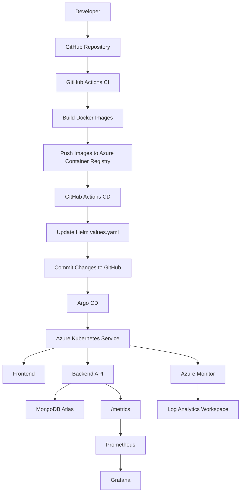

---

# 🔄 Request Flow

The following diagram illustrates how a user request travels through the application.

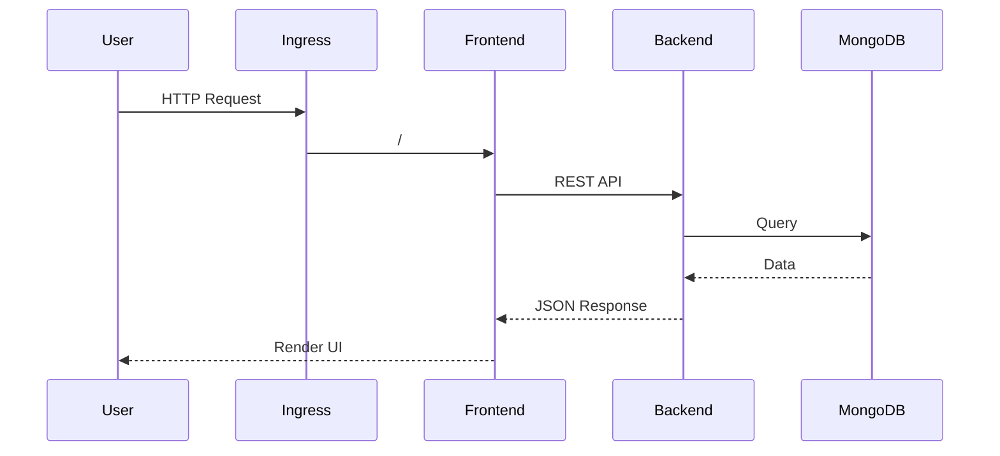

---

# 📈 Monitoring Architecture

TicketHub implements two complementary monitoring solutions.

* **Prometheus + Grafana** for application and Kubernetes metrics.
* **Azure Monitor + Log Analytics** for Azure-native infrastructure monitoring and centralized logging.

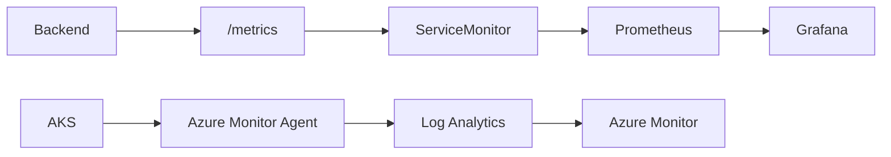

---

# 🧩 Architecture Components

| Component                      | Purpose                             |
| ------------------------------ | ----------------------------------- |
| GitHub                         | Source code management              |
| GitHub Actions                 | CI/CD automation                    |
| Azure Container Registry (ACR) | Stores Docker images                |
| Helm                           | Kubernetes package management       |
| Argo CD                        | GitOps continuous deployment        |
| Azure Kubernetes Service (AKS) | Container orchestration             |
| NGINX Ingress                  | HTTP routing                        |
| MongoDB Atlas                  | Cloud database                      |
| Prometheus                     | Metrics collection                  |
| Grafana                        | Metrics visualization               |
| Azure Monitor                  | Azure-native monitoring             |
| Log Analytics                  | Centralized logging and KQL queries |

---

# ✨ Architecture Highlights

* End-to-end CI/CD automation using GitHub Actions.
* GitOps deployment strategy with Argo CD.
* Containerized frontend and backend deployed on AKS.
* Immutable image versioning using Git commit SHA.
* Kubernetes resource management with Helm.
* Dual observability stack using Prometheus/Grafana and Azure Monitor.
* Production-ready health checks, monitoring, and centralized logging.

---

# 🛠️ Technology Stack

TicketHub leverages a modern cloud-native technology stack to implement a production-style application deployment on Microsoft Azure. Each technology serves a specific purpose in the overall software delivery lifecycle.

| Category                    | Technologies                         | Purpose                                                                          |
| --------------------------- | ------------------------------------ | -------------------------------------------------------------------------------- |
| **Frontend**                | React, Vite, JavaScript, HTML5, CSS3 | Builds the user interface and provides a fast, responsive client experience.     |
| **Backend**                 | Node.js, Express.js                  | RESTful API development, business logic, authentication, and request processing. |
| **Database**                | MongoDB Atlas                        | Fully managed cloud-hosted NoSQL database for application data.                  |
| **Containerization**        | Docker                               | Packages frontend and backend into portable, consistent container images.        |
| **Container Registry**      | Azure Container Registry (ACR)       | Securely stores versioned Docker images for deployment.                          |
| **Container Orchestration** | Azure Kubernetes Service (AKS)       | Deploys, scales, and manages containerized workloads.                            |
| **Package Management**      | Helm                                 | Templates and manages Kubernetes manifests for repeatable deployments.           |
| **GitOps**                  | Argo CD                              | Continuously synchronizes the Kubernetes cluster with the Git repository.        |
| **CI/CD**                   | GitHub Actions                       | Automates building, testing, image publishing, and deployment updates.           |
| **Networking**              | NGINX Ingress Controller             | Routes external HTTP requests to frontend and backend services.                  |
| **Monitoring**              | Prometheus Operator, Grafana         | Collects and visualizes application and Kubernetes metrics.                      |
| **Cloud Monitoring**        | Azure Monitor, Container Insights    | Provides Azure-native monitoring, diagnostics, and cluster health insights.      |
| **Logging**                 | Azure Log Analytics (KQL)            | Centralized log collection and querying using Kusto Query Language.              |
| **Configuration**           | Kubernetes ConfigMaps & Secrets      | Separates configuration and sensitive data from application code.                |
| **Version Control**         | Git, GitHub                          | Source code management and collaboration.                                        |

---

# ☁️ Cloud-Native Technologies

The project is designed around modern cloud-native engineering principles.

| Capability                  | Implementation           |
| --------------------------- | ------------------------ |
| Containerization            | Docker                   |
| Container Registry          | Azure Container Registry |
| Container Orchestration     | Azure Kubernetes Service |
| Infrastructure Packaging    | Helm Charts              |
| GitOps Deployment           | Argo CD                  |
| Continuous Integration      | GitHub Actions           |
| Continuous Deployment       | GitHub Actions + Argo CD |
| Service Discovery           | Kubernetes Services      |
| External Traffic Management | NGINX Ingress Controller |
| Application Monitoring      | Prometheus + Grafana     |
| Cloud Observability         | Azure Monitor            |
| Centralized Logging         | Azure Log Analytics      |

---

# 📦 DevOps Toolchain

The following diagram illustrates how the DevOps tools interact throughout the software delivery lifecycle.

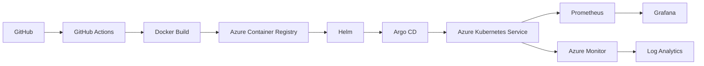

---

# 🎯 Key Engineering Practices

The project demonstrates several production-oriented engineering practices:

* Automated Continuous Integration (CI)
* Automated Continuous Deployment (CD)
* GitOps-based Kubernetes deployments
* Infrastructure templating using Helm
* Immutable Docker image versioning
* Containerized microservice deployment
* Kubernetes health probes (Liveness & Readiness)
* Resource requests and limits
* Application and infrastructure monitoring
* Azure-native observability
* Centralized logging and diagnostics
* Cloud-native deployment on Microsoft Azure

---

# ✨ Features

TicketHub is designed to demonstrate both **application development** and **production-grade DevOps practices**. The project showcases the complete lifecycle of building, deploying, monitoring, and operating a cloud-native application on Microsoft Azure.

---

## 🎫 Application Features

* 🎬 Browse available movies
* 🏢 View theaters and show timings
* 🎟️ Book movie tickets
* 👤 User authentication and authorization
* 🔑 JWT-based secure authentication
* 🛠️ Admin management for movies and theaters
* 🌐 RESTful API architecture
* 📱 Responsive React frontend

---

## ☁️ Cloud & Infrastructure Features

* Microsoft Azure cloud deployment
* Azure Kubernetes Service (AKS)
* Azure Container Registry (ACR)
* MongoDB Atlas integration
* Cloud-native architecture
* Highly portable containerized workloads

---

## 🐳 Containerization

* Dockerized frontend
* Dockerized backend
* Versioned Docker images
* Immutable image tagging using Git commit SHA
* Images stored in Azure Container Registry

---

## ☸️ Kubernetes Features

* Kubernetes Deployments
* Kubernetes Services
* NGINX Ingress Controller
* ConfigMaps
* Secrets
* Namespace isolation
* Resource Requests
* Resource Limits
* Liveness Probes
* Readiness Probes
* Rolling Updates
* Service discovery within the cluster

---

## 📦 Helm Features

* Reusable Helm Chart
* Parameterized `values.yaml`
* Environment-specific configuration
* Template-driven Kubernetes manifests
* Simplified application deployment

---

## ⚙️ CI/CD Features

* Automated Continuous Integration using GitHub Actions
* Automated Docker image build
* Automatic push to Azure Container Registry
* Automatic Helm image tag updates
* Automatic Git commits for deployment changes
* Automated Continuous Deployment pipeline

---

## 🔄 GitOps Features

* Argo CD continuous deployment
* Git as the single source of truth
* Automatic synchronization between GitHub and AKS
* Declarative Kubernetes deployments
* Version-controlled infrastructure

---

## 📊 Monitoring & Observability

### Prometheus

* Custom application metrics
* Kubernetes metrics collection
* ServiceMonitor integration
* Automatic metrics scraping

### Grafana

* Application dashboard
* Kubernetes dashboard
* Infrastructure dashboard
* Performance visualization
* Resource utilization monitoring

### Azure Monitor

* Container Insights
* Azure-native monitoring
* Log Analytics integration
* Cluster health monitoring
* Infrastructure monitoring
* Kusto Query Language (KQL) support

---

## 🔐 Security & Configuration

* Kubernetes Secrets
* ConfigMaps
* Environment variable management
* Secure MongoDB Atlas connection
* Secure Azure Container Registry authentication
* Kubernetes namespace isolation

---

## 🚀 Production-Ready Practices

* Automated deployment pipeline
* GitOps workflow
* Immutable deployments
* Health monitoring
* Resource optimization
* Infrastructure as code using Helm
* Centralized logging
* Real-time monitoring
* Cloud-native deployment architecture
* Production-style Kubernetes configuration

---

# 🌟 Project Highlights

This project demonstrates practical implementation of:

* Full-stack application development
* Cloud-native application deployment
* Kubernetes orchestration
* GitOps workflows
* CI/CD automation
* Container lifecycle management
* Production monitoring and observability
* Azure cloud services integration
* Modern DevOps engineering practices

---

# 📂 Repository Structure

The project is organized into separate components to maintain a clean separation between application code, Kubernetes resources, deployment automation, and documentation.

```text
TicketHub/
│
├── .github/
│   └── workflows/
│       ├── backend-ci.yml
│       ├── frontend-ci.yml
│       └── cd.yml
│
├── client/
│
├── server/
│
├── helm/
│   └── tickethub/
│       ├── templates/
│       ├── Chart.yaml
│       └── values.yaml
│
├── k8s/
│
├── README.md
│
└── LICENSE
```

---

# 📁 Directory Overview

### `.github/workflows/`

Contains the GitHub Actions workflows responsible for automating the CI/CD pipeline.

**Responsibilities**

* Build frontend Docker image
* Build backend Docker image
* Push images to Azure Container Registry (ACR)
* Update Helm image tags
* Commit deployment changes back to GitHub

---

### `client/`

Contains the React frontend application.

**Responsibilities**

* User interface
* Movie browsing
* Ticket booking
* Authentication
* API integration

---

### `server/`

Contains the Express.js backend API.

**Responsibilities**

* Business logic
* Authentication
* Booking management
* Movie management
* Theater management
* Database interaction
* Prometheus metrics endpoint

---

### `helm/tickethub/`

Contains the Helm chart used to deploy the application to Kubernetes.

**Key Files**

| File          | Purpose                        |
| ------------- | ------------------------------ |
| `Chart.yaml`  | Helm chart metadata            |
| `values.yaml` | Configurable deployment values |
| `templates/`  | Kubernetes manifest templates  |

---

### `k8s/`

Contains Kubernetes resources that are not packaged as part of the Helm chart.

Examples include:

* Monitoring resources
* Ingress definitions (if managed separately)
* ServiceMonitor
* Additional cluster configuration

---

# 📦 Backend Structure

```text
server/src/

├── config/
├── controllers/
├── middleware/
├── models/
├── monitoring/
├── routes/
├── services/
├── utils/
├── app.js
└── server.js
```

### Backend Components

| Directory      | Responsibility                                  |
| -------------- | ----------------------------------------------- |
| `config/`      | Database and application configuration          |
| `controllers/` | HTTP request handling                           |
| `services/`    | Business logic                                  |
| `models/`      | MongoDB models                                  |
| `routes/`      | API endpoints                                   |
| `middleware/`  | Authentication, metrics, and request middleware |
| `monitoring/`  | Prometheus metrics configuration                |
| `utils/`       | Shared helper functions                         |

---

# 🎨 Frontend Structure

```text
client/

├── public/
├── src/
├── package.json
└── vite.config.js
```

The frontend is responsible for:

* Rendering the user interface
* Calling backend APIs
* Authentication flow
* Displaying movies, theaters, and bookings
* Responsive user experience

---

# 🚀 Deployment Assets

The deployment pipeline consists of several independent components working together.

| Component                | Purpose                             |
| ------------------------ | ----------------------------------- |
| GitHub Actions           | Continuous Integration & Deployment |
| Docker                   | Container image creation            |
| Azure Container Registry | Image repository                    |
| Helm                     | Kubernetes package management       |
| Argo CD                  | GitOps deployment                   |
| AKS                      | Container orchestration             |
| Prometheus               | Metrics collection                  |
| Grafana                  | Metrics visualization               |
| Azure Monitor            | Cloud-native monitoring             |

---

# 🗂️ Project Organization Principles

The repository follows a modular structure to keep application code, infrastructure, deployment configuration, and automation isolated from one another.

This organization provides several benefits:

* Clear separation of concerns
* Easier maintenance
* Better scalability
* Simplified onboarding for contributors
* Production-style repository layout
* Improved readability and navigation


---

# ⚙️ CI/CD Pipeline

TicketHub implements a fully automated **Continuous Integration (CI)** and **Continuous Deployment (CD)** pipeline using **GitHub Actions**, **Docker**, **Azure Container Registry (ACR)**, **Helm**, and **Argo CD**.

The pipeline automatically builds, packages, and deploys the application whenever changes are pushed to the repository. This eliminates manual deployment steps, ensures deployment consistency, and enables rapid software delivery.

---

## 🔄 CI/CD Workflow

```mermaid
flowchart LR

A[Developer Pushes Code] --> B[GitHub Repository]

B --> C[GitHub Actions]

C --> D[Checkout Source Code]

D --> E[Install Dependencies]

E --> F[Build Application]

F --> G[Build Docker Images]

G --> H[Push Images to Azure Container Registry]

H --> I[Update Helm values.yaml]

I --> J[Commit Updated Image Tags]

J --> K[Push Changes to GitHub]

K --> L[Argo CD Detects Changes]

L --> M[Deploy to Azure Kubernetes Service]
```

---

## 🚀 Continuous Integration (CI)

Whenever code is pushed to the repository, GitHub Actions automatically triggers the Continuous Integration workflow.

### CI Responsibilities

* Checkout the latest source code
* Install project dependencies
* Build the frontend application
* Build the backend application
* Build Docker images
* Tag Docker images using the Git commit SHA
* Push Docker images to Azure Container Registry (ACR)

This ensures that every deployment is based on immutable, versioned container images.

---

## 🚢 Continuous Deployment (CD)

After successfully publishing the Docker images, the deployment workflow automatically updates the Kubernetes deployment configuration.

### CD Responsibilities

* Retrieve the newly generated Docker image tags
* Update the Helm `values.yaml` file
* Commit the updated image tags to the Git repository
* Push the changes to the `main` branch
* Trigger the GitOps deployment through Argo CD

This approach ensures that Git always represents the desired state of the Kubernetes cluster.

---

## 📦 Docker Image Versioning

To provide traceability and reproducibility, Docker images are tagged using the Git commit SHA.

### Example

```text
tickethub-backend:ba40378b5398baaa3e432df584e24b61cb759b01
tickethub-frontend:ba40378b5398baaa3e432df584e24b61cb759b01
```

### Benefits

* Immutable deployments
* Easy rollback to previous versions
* Complete traceability between source code and deployed containers
* Consistent versioning across all environments

---

## 🔄 Deployment Lifecycle

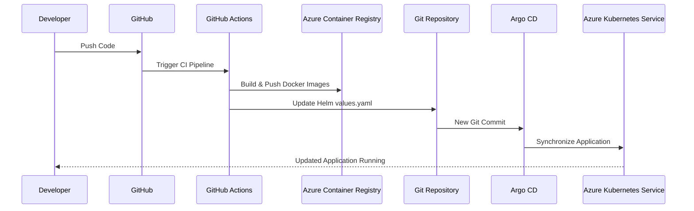

---

## 🔐 Deployment Strategy

The deployment pipeline follows several production-ready engineering practices:

* Automated build and deployment
* Immutable Docker image versioning
* GitOps-based deployment model
* Declarative Kubernetes manifests
* Version-controlled infrastructure
* Repeatable deployments
* No manual changes inside the Kubernetes cluster

---

## 🌟 Benefits of the CI/CD Pipeline

* Faster software delivery
* Reduced manual deployment effort
* Consistent deployments across environments
* Improved deployment reliability
* Simplified rollback using Git history
* Complete deployment traceability
* Seamless integration with GitOps workflows

---

## 📊 CI/CD Summary

| Stage                    | Tool                           | Responsibility                                      |
| ------------------------ | ------------------------------ | --------------------------------------------------- |
| Source Control           | GitHub                         | Version control and collaboration                   |
| Continuous Integration   | GitHub Actions                 | Build, test, package, and publish the application   |
| Containerization         | Docker                         | Create portable and reproducible application images |
| Container Registry       | Azure Container Registry (ACR) | Store versioned Docker images                       |
| Deployment Configuration | Helm                           | Manage Kubernetes deployment configuration          |
| GitOps                   | Argo CD                        | Synchronize the Git repository with the AKS cluster |
| Container Orchestration  | Azure Kubernetes Service (AKS) | Run and manage the application in production        |

---

# 🔄 GitOps Workflow

TicketHub follows the **GitOps** methodology for Kubernetes deployments using **Argo CD**.

Instead of deploying resources directly to the Kubernetes cluster, every infrastructure and application change is first committed to the Git repository. Argo CD continuously monitors the repository and reconciles the live Kubernetes cluster with the desired state stored in Git.

This approach makes Git the **single source of truth** for the entire deployment process.

---

## 🏗️ GitOps Architecture

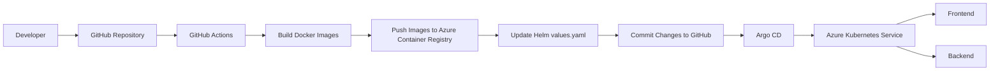

---

## 🔄 GitOps Deployment Workflow

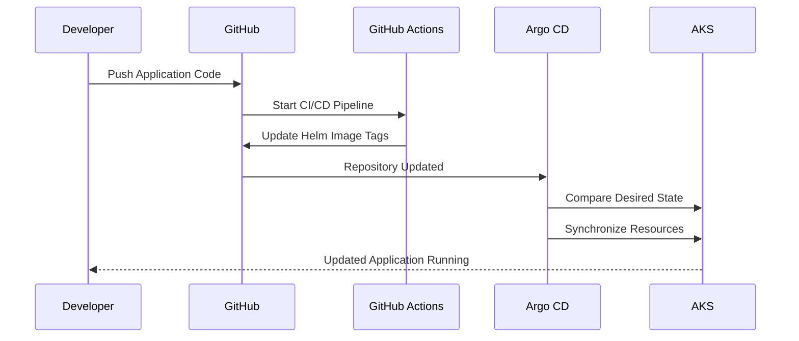

---

## 🌟 Desired State vs Live State

GitOps is based on continuously comparing two states:

| State             | Description                                                               |
| ----------------- | ------------------------------------------------------------------------- |
| **Desired State** | Kubernetes manifests and Helm configuration stored in the Git repository. |
| **Live State**    | Resources currently running inside the AKS cluster.                       |

Argo CD continuously compares these two states and reports whether the application is **Synced** or **OutOfSync**.

---

## ⚙️ Argo CD Responsibilities

Argo CD performs the following tasks automatically:

* Continuously monitors the Git repository
* Detects changes to Kubernetes manifests and Helm values
* Compares the desired state with the live cluster state
* Synchronizes the cluster when differences are detected
* Displays application health and synchronization status
* Maintains deployment history and revision tracking

---

## 📌 GitOps Workflow in TicketHub

The deployment process follows these steps:

1. Developer pushes code to GitHub.
2. GitHub Actions builds the frontend and backend Docker images.
3. Docker images are pushed to Azure Container Registry (ACR).
4. GitHub Actions updates the Helm `values.yaml` file with the latest image tags.
5. The updated Helm configuration is committed back to the Git repository.
6. Argo CD detects the new commit.
7. Argo CD synchronizes the Kubernetes cluster.
8. AKS performs a rolling update with the latest application version.
9. Prometheus, Grafana, and Azure Monitor continue monitoring the updated deployment.

---

## 🚀 Advantages of GitOps

* Git becomes the single source of truth
* Fully declarative Kubernetes deployments
* Automatic synchronization with the cluster
* Easy rollback using Git history
* Version-controlled infrastructure
* Improved deployment consistency
* Reduced manual operational effort
* Clear deployment audit trail

---

## 📊 GitOps Summary

| Component                      | Responsibility                                  |
| ------------------------------ | ----------------------------------------------- |
| GitHub                         | Stores application and deployment configuration |
| GitHub Actions                 | Builds images and updates Helm values           |
| Helm                           | Templates Kubernetes manifests                  |
| Argo CD                        | Continuously synchronizes Git with AKS          |
| Azure Kubernetes Service (AKS) | Executes the desired application state          |
| Azure Container Registry (ACR) | Stores versioned Docker images                  |

---

> **GitOps ensures that every deployment is reproducible, version-controlled, and automatically synchronized, making Git the authoritative source for the Kubernetes cluster configuration.**

---

# ☸️ Kubernetes Deployment

TicketHub is deployed on **Azure Kubernetes Service (AKS)** using Kubernetes-native resources managed through **Helm** and synchronized with **Argo CD**.

The deployment follows production-oriented Kubernetes practices, including health probes, resource management, namespace isolation, configuration externalization, and rolling updates.

---

## 🏗️ Kubernetes Architecture

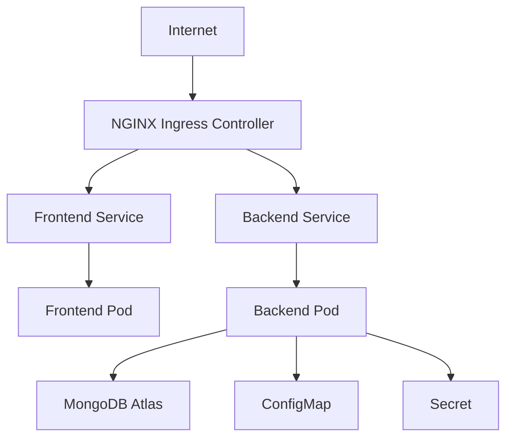

---

## 📦 Kubernetes Resources

The application consists of the following Kubernetes resources.

| Resource       | Purpose                                              |
| -------------- | ---------------------------------------------------- |
| Namespace      | Isolates TicketHub resources within the cluster      |
| Deployment     | Manages frontend and backend pods                    |
| Service        | Exposes frontend and backend applications internally |
| Ingress        | Routes external HTTP requests to the correct service |
| ConfigMap      | Stores application configuration                     |
| Secret         | Stores sensitive configuration values                |
| ServiceMonitor | Enables Prometheus metrics scraping                  |

---

## 🚀 Backend Deployment

The backend deployment is responsible for running the Express.js API.

### Features

* Multiple replicas
* Rolling updates
* Liveness probe
* Readiness probe
* Resource requests
* Resource limits
* Environment variables from ConfigMaps
* Sensitive values from Kubernetes Secrets

---

## 🎨 Frontend Deployment

The frontend deployment hosts the React application.

### Features

* Multiple replicas
* NGINX web server
* Rolling updates
* Resource requests
* Resource limits
* Kubernetes Service integration

---

## 🌐 Networking

External traffic enters the cluster through the **NGINX Ingress Controller**.

Routing rules:

| Path        | Destination       |
| ----------- | ----------------- |
| `/`         | Frontend Service  |
| `/api/v1/*` | Backend Service   |
| `/grafana`  | Grafana Dashboard |

The Ingress Controller provides a single entry point for all HTTP requests.

---

## ❤️ Health Checks

TicketHub uses Kubernetes health probes to ensure application availability.

### Liveness Probe

Purpose:

* Detects unhealthy containers
* Automatically restarts failed containers

Backend endpoint:

```text
/health
```

---

### Readiness Probe

Purpose:

* Determines whether the application is ready to receive traffic
* Prevents requests from reaching unhealthy or initializing pods

Backend endpoint:

```text
/health
```

---

## ⚙️ Resource Management

Each deployment defines resource requests and limits.

### Benefits

* Prevents resource starvation
* Improves scheduling decisions
* Protects cluster stability
* Supports predictable application performance

---

## 🔐 Configuration Management

Application configuration is externalized using Kubernetes-native resources.

| Resource  | Stores                            |
| --------- | --------------------------------- |
| ConfigMap | Non-sensitive configuration       |
| Secret    | Sensitive credentials and secrets |

This separation allows configuration changes without rebuilding container images.

---

## 📈 Deployment Strategy

TicketHub uses Kubernetes **Rolling Updates**.

Benefits include:

* Zero-downtime deployments
* Gradual pod replacement
* Automatic rollback support
* High application availability

---

## 📊 Kubernetes Summary

| Component                      | Responsibility                   |
| ------------------------------ | -------------------------------- |
| Azure Kubernetes Service (AKS) | Container orchestration platform |
| Namespace                      | Resource isolation               |
| Deployment                     | Pod lifecycle management         |
| Service                        | Internal networking              |
| Ingress                        | External traffic routing         |
| ConfigMap                      | Application configuration        |
| Secret                         | Sensitive configuration          |
| ServiceMonitor                 | Prometheus metrics discovery     |

---

> **By leveraging Kubernetes-native resources and Helm, TicketHub achieves a scalable, resilient, and production-ready deployment architecture on Azure Kubernetes Service.**

---

# 📊 Monitoring & Observability

TicketHub implements a comprehensive monitoring solution by combining **Prometheus**, **Grafana**, and **Azure Monitor** to provide visibility into application performance, Kubernetes resources, and Azure infrastructure.

The monitoring stack enables real-time metrics collection, visualization, infrastructure monitoring, and centralized logging.

---

## 🏗️ Monitoring Architecture

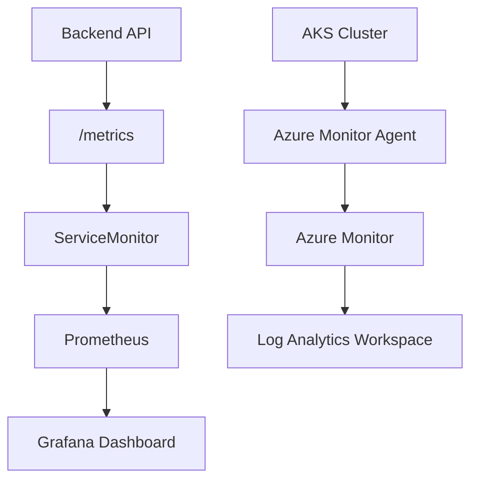

---

# 📈 Monitoring Stack

| Component           | Purpose                                             |
| ------------------- | --------------------------------------------------- |
| Prometheus          | Collects application and Kubernetes metrics         |
| Grafana             | Visualizes metrics using custom dashboards          |
| Azure Monitor       | Provides Azure-native infrastructure monitoring     |
| Log Analytics       | Stores logs and supports Kusto Query Language (KQL) |
| Prometheus Operator | Manages Prometheus resources inside Kubernetes      |
| ServiceMonitor      | Automatically discovers application metrics         |

---

# 📌 Prometheus

The backend application exposes metrics through the `/metrics` endpoint using the **prom-client** library.

Prometheus automatically discovers the backend using a Kubernetes **ServiceMonitor** and periodically scrapes application metrics.

### Metrics Collected

* Total HTTP Requests
* Request Rate
* Request Duration
* HTTP Status Codes
* Node.js Runtime Metrics
* Process Metrics
* Memory Usage
* CPU Usage

---

# 📊 Grafana

Grafana is connected to Prometheus and provides interactive dashboards for monitoring the application and Kubernetes cluster.

### Dashboard Sections

#### Application Metrics

* Requests per Second
* Total Requests
* Average Response Time
* P95 Latency

#### API Metrics

* Requests by Route
* HTTP Methods
* HTTP Status Codes

#### Backend Metrics

* CPU Usage
* Memory Usage
* Heap Usage
* Event Loop Metrics

#### Kubernetes Metrics

* Running Pods
* Pod CPU Usage
* Pod Memory Usage
* Pod Restart Count

#### Node Metrics

* Node CPU Usage
* Node Memory Usage
* Disk Utilization

---

# ☁️ Azure Monitor

Azure Monitor provides cloud-native monitoring capabilities for the AKS cluster.

### Features

* Container Insights
* Cluster Health Monitoring
* Node Performance
* Pod Inventory
* Container Inventory
* Resource Utilization
* Platform Metrics

---

# 📝 Azure Log Analytics

Application and infrastructure logs are collected into a Log Analytics Workspace, where they can be queried using **Kusto Query Language (KQL)**.

Example use cases include:

* Investigating pod failures
* Viewing container logs
* Monitoring node health
* Inspecting Kubernetes resources
* Troubleshooting deployments

---

# 🔄 Monitoring Workflow

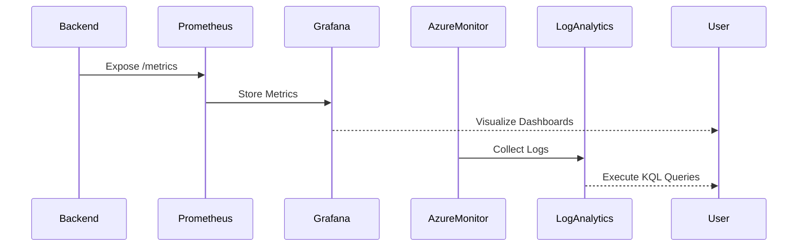

---

# 📊 Key Metrics

The monitoring solution provides visibility into multiple layers of the application stack.

| Layer          | Metrics                                            |
| -------------- | -------------------------------------------------- |
| Application    | Request Count, Request Rate, Latency, Status Codes |
| Backend        | CPU Usage, Memory Usage, Heap Usage                |
| Kubernetes     | Pods, Deployments, Services, Resource Usage        |
| Infrastructure | Node CPU, Node Memory, Disk Usage                  |
| Azure          | Container Insights, Cluster Health, Log Analytics  |

---

# 🌟 Monitoring Highlights

* Real-time application metrics
* Kubernetes resource monitoring
* Azure-native infrastructure monitoring
* Interactive Grafana dashboards
* Prometheus Operator integration
* Automatic metrics discovery with ServiceMonitor
* Centralized logging using Azure Log Analytics
* KQL support for advanced log analysis

---

> **The observability stack provides complete visibility into the application, Kubernetes cluster, and Azure infrastructure, enabling proactive monitoring and faster troubleshooting in a production environment.**

---

# 🚀 Deployment Guide

This section provides the high-level deployment process used to deploy TicketHub on **Azure Kubernetes Service (AKS)**.

The deployment is fully automated using **GitHub Actions**, **Helm**, and **Argo CD**, following GitOps principles.

---

# 📋 Prerequisites

Before deploying the application, ensure the following tools and services are available.

| Tool / Service                 | Purpose                       |
| ------------------------------ | ----------------------------- |
| Git                            | Source code management        |
| Docker                         | Build container images        |
| Azure CLI                      | Azure resource management     |
| kubectl                        | Kubernetes cluster management |
| Helm                           | Kubernetes package management |
| GitHub Account                 | Source code hosting           |
| Azure Subscription             | Cloud infrastructure          |
| Azure Kubernetes Service (AKS) | Kubernetes cluster            |
| Azure Container Registry (ACR) | Docker image registry         |
| Argo CD                        | GitOps deployment             |

---

# 🏗️ Deployment Workflow

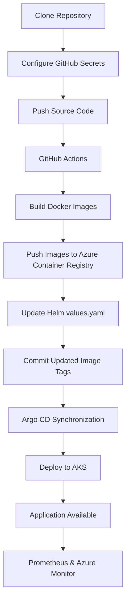

---

# 🔄 End-to-End Deployment Steps

## 1️⃣ Clone the Repository

Clone the project repository to your local machine.

```bash
git clone https://github.com/<username>/TicketHub.git
cd TicketHub
```

---

## 2️⃣ Configure Azure Resources

Create the required Azure resources.

* Azure Resource Group
* Azure Kubernetes Service (AKS)
* Azure Container Registry (ACR)
* Log Analytics Workspace
* Azure Monitor

---

## 3️⃣ Configure GitHub Secrets

Configure the required GitHub Actions secrets.

Example secrets include:

* Azure Credentials
* Azure Subscription ID
* Azure Tenant ID
* Azure Client ID
* Azure Client Secret
* Azure Container Registry Name
* ACR Username
* ACR Password

---

## 4️⃣ Push Application Code

Push code to the repository.

GitHub Actions automatically starts the CI/CD pipeline.

---

## 5️⃣ Continuous Integration

GitHub Actions performs the following tasks:

* Checkout source code
* Install dependencies
* Build frontend
* Build backend
* Build Docker images
* Push images to Azure Container Registry

---

## 6️⃣ Continuous Deployment

After a successful build:

* Update Helm image tags
* Commit changes
* Push updated Helm configuration
* Trigger GitOps deployment

---

## 7️⃣ GitOps Synchronization

Argo CD continuously monitors the repository.

When a new commit is detected:

* Compare desired state
* Synchronize AKS cluster
* Perform rolling update
* Verify deployment health

---

## 8️⃣ Application Deployment

Once synchronization completes:

* Frontend pods start
* Backend pods start
* Services become available
* Ingress routes external traffic
* Health probes verify application readiness

---

## 9️⃣ Monitoring

After deployment, monitoring starts automatically.

### Prometheus

* Discovers ServiceMonitor
* Scrapes application metrics

### Grafana

* Displays application dashboards

### Azure Monitor

* Collects infrastructure metrics
* Sends logs to Log Analytics

---

# 🌍 Application Endpoints

| Component          | Endpoint   |
| ------------------ | ---------- |
| Frontend           | `/`        |
| Backend API        | `/api/v1`  |
| Health Check       | `/health`  |
| Prometheus Metrics | `/metrics` |
| Grafana            | `/grafana` |

---

# ✅ Deployment Verification

After deployment, verify the following:

* AKS cluster is running
* Frontend and backend pods are healthy
* Argo CD application status is **Healthy** and **Synced**
* Application is accessible through the Ingress
* Prometheus targets are **UP**
* Grafana dashboards display metrics
* Azure Monitor receives cluster telemetry

---

# 🎯 Deployment Summary

The deployment process is fully automated and follows modern DevOps and GitOps practices.

* Source code changes trigger automated CI/CD.
* Docker images are built and stored in Azure Container Registry.
* Helm manages Kubernetes deployment configuration.
* Argo CD synchronizes the Kubernetes cluster with Git.
* AKS performs rolling deployments.
* Prometheus, Grafana, and Azure Monitor provide end-to-end observability.

> **The entire deployment lifecycle—from source code to production—is automated, reproducible, and managed through GitOps, ensuring consistency, reliability, and traceability.**

---

# 📸 Project Showcase

The following screenshots demonstrate the complete software delivery lifecycle of TicketHub, from development and deployment to monitoring and cloud observability.

---

## 🎟️ Application

The TicketHub web application provides a responsive interface for browsing movies, selecting theaters, and booking tickets.

<p align="center">
  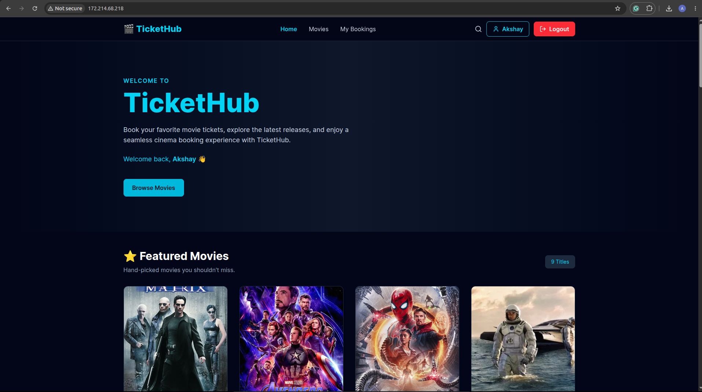
</p>

---

## ⚙️ GitHub Actions

GitHub Actions automates the CI/CD workflow.

<p align="center">
  
</p>

---

## 🚢 Azure Container Registry (ACR)

Docker images are automatically pushed to Azure Container Registry.

<p align="center">
  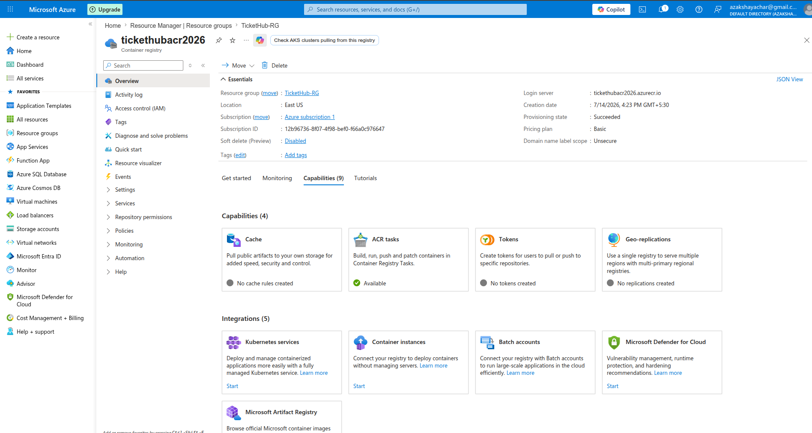
</p>

---

## 🔄 Argo CD

Argo CD continuously synchronizes the Kubernetes cluster with Git.

<p align="center">
  
</p>

---

## ☸️ Azure Kubernetes Service (AKS)

The application is deployed on Azure Kubernetes Service.

<p align="center">
  
</p>

---

## 📊 Grafana Dashboard

Grafana visualizes application and infrastructure metrics.

<p align="center">
  
</p>

---

## 📈 Prometheus

Prometheus scrapes application metrics from the backend.

<p align="center">
  
</p>

---

## ☁️ Azure Monitor

Azure Monitor provides cloud-native observability.

<p align="center">
  
</p>

---

## 📝 Azure Log Analytics

Logs are collected and queried using Kusto Query Language (KQL).

<p align="center">
  
</p>

---

## 🏛️ Overall Architecture

The following architecture summarizes the complete deployment workflow.

<p align="center">
  
</p>

# 🚀 Future Enhancements

The current implementation demonstrates a production-ready cloud-native deployment using Azure Kubernetes Service, GitOps, CI/CD, and comprehensive monitoring. The following enhancements are planned for future iterations of the project.

---

## ☸️ Kubernetes

* Horizontal Pod Autoscaler (HPA) for automatic scaling based on CPU and memory utilization.
* Multi-environment deployments (Development, Staging, and Production).
* Pod Disruption Budgets (PDB) for improved application availability during node maintenance.
* Kubernetes Network Policies for fine-grained network security.

---

## ☁️ Azure

* Infrastructure provisioning using Terraform or Bicep.
* Azure Key Vault integration for secure secret management.
* Custom domain with HTTPS using Azure DNS and TLS certificates.
* Azure Application Gateway integration for advanced traffic management.

---

## ⚙️ DevOps

* Automated unit and integration testing in the CI pipeline.
* Automated security scanning for Docker images.
* Dependency vulnerability scanning.
* Release versioning and automated changelog generation.

---

## 📊 Monitoring & Observability

* Advanced Grafana dashboards with business metrics.
* Custom Prometheus alerts for application health and infrastructure.
* Distributed tracing using OpenTelemetry.
* Long-term metrics storage for historical trend analysis.

---

## 🔐 Security

* Role-Based Access Control (RBAC) enhancements.
* Container image signing and verification.
* Runtime security scanning.
* Kubernetes security policy enforcement.

---

## 🚀 Performance

* Redis caching for frequently accessed data.
* CDN integration for static frontend assets.
* Database query optimization.
* Load testing and performance benchmarking.

---

## 🌍 Scalability

* Multi-node AKS cluster deployment.
* Multi-region deployment strategy.
* Blue-Green and Canary deployment strategies.
* Disaster recovery and backup automation.

---

> This project will continue evolving as new cloud-native technologies, Kubernetes best practices, and Azure services are explored.

# 👨‍💻 Author

## Akshay

**Azure Cloud & DevOps Enthusiast**

Passionate about designing, deploying, and operating cloud-native applications on Microsoft Azure using modern DevOps, Kubernetes, and GitOps practices. I enjoy building production-ready solutions that emphasize automation, scalability, reliability, and observability.

---

## 📬 Connect with Me

* 🌐 **Portfolio:** https://akshayachar03.netlify.app
* 💼 **LinkedIn:** https://www.linkedin.com/in/akshayacahar
* 💻 **GitHub:** https://github.com/akshayachar03
* 📧 **Email:** akshayachar03@gmail.com

---

## 🤝 Feedback & Contributions

Feedback, suggestions, and contributions are always welcome.

If you find this project useful or interesting:

* ⭐ Star the repository
* 🍴 Fork the project
* 🐞 Report issues
* 💡 Share ideas for future improvements
